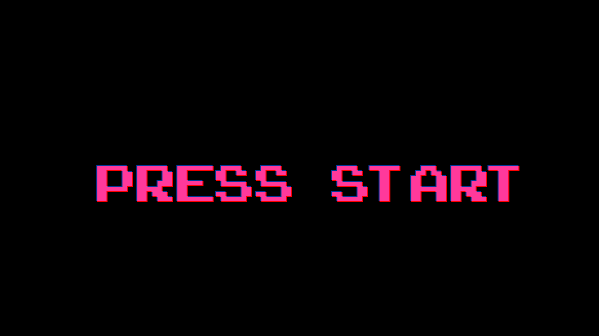
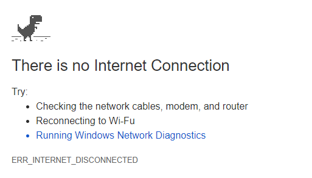

# "Offline"
**"Offline"** Game for 2018 [js13kgames](http://js13kgames.com) game dev challenge.

*or*

[Play Now!](http://offline.elnath.uberspace.de)

***

***

Minify done with:
* HTML -> [willpeavy](https://www.willpeavy.com/minifier/)
* JS -> [jscompress](https://jscompress.com/)

***

### "Features"
* Web Multiplayer
* Moving Left and Right (A & D)
* Jumping (Space), double jump
* Choose hat Color
* Walk and watch your hat grow
* Write Messages
* Project Size under 13 KB

***

### Normal File Sizes

| Filename           | Size (in Bytes) |
|:------------------:| ---------------:|
| package.json	     | 361	           |
| server.js 	     | 996	           |
| client.js	         | 1599  	       |
| control.js	     | 475 	           |
| render.js 	     | 3314 	       |
| Dino.js     	     | 2284	           |
| index.html         | 2781 	       |
| dino.png    	     | 2433	           |
| rex.png    	     | 196	           |
| **Total:** 	     | `~14'439` 	   |

***

### Minified File Sizes

| Filename           | Size (in Bytes) |
|:------------------:| ---------------:|
| package.json	     | 361	           |
| server.js 	     | 606	           |
| script.js     	 | 4725	           |
| index.html         | 1822 	       |
| dino.png    	     | 2433	           |
| rex.png    	     | 196	           |
| **Total:** 	     | `~10'143` 	   |

***

### Zipped Project Size
* 1x Zipped **Winrar**: 6413 Bytes
* 1x Zipped **Windows**: 6530 Bytes
* 2x Zipped (**Winrar then Windows**): 6545 Bytes

